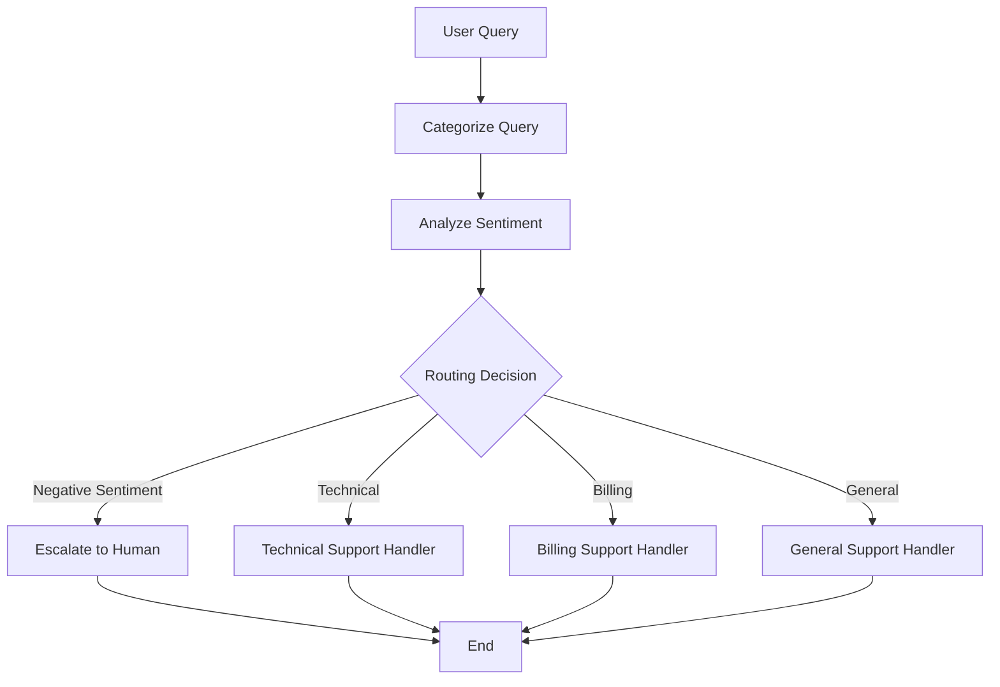

<div align="center"> 

# 🤖 LangGraph Customer Support Agent

A stateful, graph-based customer support agent built with LangGraph and LangChain that classifies queries, analyses sentiment, routes to specialist handlers (Technical, Billing, General), and auto-escalates negative-sentiment cases to a human agent.

<p align="center">


</p>

</div>

---

## 📖 Overview

**LangGraph Support Agent** is a production-ready, stateful AI agent that handles customer queries end-to-end using a **directed graph workflow**. Each incoming query passes through three sequential stages- categorisation, sentiment analysis, and smart routing before reaching the right specialist. Negative-sentiment queries are automatically escalated to a human agent, preventing frustrated customers from falling through the cracks.

The project is fully modular, cleanly tested with `pytest`, and designed to be extended - swap the LLM, add new query categories, or connect to a real ticketing system with changes confined to a single file.

---

## ✨ Features

- 🧠 **Multi-stage intelligent workflow**: Categorise → Sentiment → Route → Handle, all in one stateful graph
- 🚨 **Auto-escalation**: negative-sentiment queries bypass handlers and go straight to a human agent
- 🔀 **Three specialist handlers**: Technical, Billing, and General support, each with tailored prompts
- 📊 **Graph visualisation**: export the entire workflow as a PNG or view it live in Jupyter
- 🧩 **Fully modular**: add categories, swap LLMs, or connect APIs by editing one file
- ✅ **Unit tested**: `pytest` suite covering all node functions and routing logic
- 🔒 **Secure config**: all credentials loaded from `.env`, never hardcoded

---

## 📋 Workflow



---

## 🔧 Node Descriptions

Each node is a pure function in `agents/nodes.py` that reads from and writes to the shared `AgentState`:

| Node | Role | LLM Used | Output to State |
|------|------|----------|-----------------|
| `categorise_query` | Classifies the query into Technical, Billing, or General | GPT (chat) | `category` |
| `analyse_sentiment` | Detects Positive, Neutral, or Negative sentiment | GPT (chat) | `sentiment` |
| `route_query` | Conditional edge - reads category + sentiment, returns next node name | _(logic only)_ | _(routing)_ |
| `handle_technical` | Generates a technical support response | GPT (chat) | `response` |
| `handle_billing` | Generates a billing support response | GPT (chat) | `response` |
| `handle_general` | Generates a general support response | GPT (chat) | `response` |
| `escalate_to_human` | Flags the case and generates an escalation message | GPT (chat) | `response`, `escalated=True` |

---

## 🚦 Routing Logic

The `route_query` function applies this decision matrix:

| Sentiment | Category | → Routed To |
|-----------|----------|-------------|
| Negative | _Any_ | 🚨 Escalate to Human |
| Positive / Neutral | Technical | 🔧 Technical Handler |
| Positive / Neutral | Billing | 💳 Billing Handler |
| Positive / Neutral | General | 💬 General Handler |

> Sentiment check always runs **first** a frustrated user with a technical issue gets a human, not a bot.

---

## 🛠️ Tech Stack

| Tool | Purpose |
|------|---------|
| `LangGraph` | Stateful directed graph - defines the agent's nodes and edges |
| `LangChain` | LLM abstraction, prompt templates, chain orchestration |
| `OpenAI` | GPT models for all LLM nodes (swappable via `config/settings.py`) |
| `Pydantic` | State schema definition and validation |
| `python-dotenv` | Secure `.env` API key loading |
| `pytest` | Unit test suite for all node functions |

---

## ⚙️ Requirements

- Python 3.8+
- An OpenAI API key ([get one here](https://platform.openai.com/api-keys))

---

## 🚀 Getting Started

**1. Clone the repository**
```bash
git clone https://github.com/MusaIslamFahad/Customer_Support_Agent.git
cd Customer_Support_Agent
```

**2. Create and activate a virtual environment**
```bash
python -m venv .venv

source .venv/bin/activate        # macOS / Linux
.venv\Scripts\activate           # Windows
```

**3. Install dependencies**
```bash
pip install -r requirements.txt
```

**4. Configure your API key**
```bash
cp .env.example .env
```

Open `.env` and add your key:
```
OPENAI_API_KEY=your_openai_api_key_here
```

> ⚠️ **Security:** `.env` is already in `.gitignore` — never commit your API key.

**5. Run the agent**
```bash
python main.py
```

---

## 🕹️ Example Queries

`main.py` ships with sample queries that demonstrate each routing path:

```python
# Technical query → routed to Technical Handler
"My application keeps crashing when I try to upload files larger than 10MB."

# Billing query with negative sentiment → escalated to Human Agent
"This is outrageous! You charged me twice this month and nobody is responding!"

# General query → routed to General Handler
"What are your business hours and do you offer weekend support?"
```

**Sample output:**
```
============================================================
Query: My application keeps crashing when I try to upload files...
------------------------------------------------------------
Category  : Technical
Sentiment : Neutral
Routed to : Technical Handler
------------------------------------------------------------
Response  : Thank you for reaching out. This sounds like it may be
            related to file size limits on our upload service...
============================================================
```

---

## 📊 Visualising the Graph

Export the full workflow as a PNG:

```python
from utils import save_graph
save_graph("workflow.png")
```

View it live in Jupyter:

```python
from utils import show_graph
show_graph()
```

---

## ✅ Running Tests

```bash
pytest tests/
```

The test suite in `tests/test_nodes.py` covers:
- Query categorisation for all three categories
- Sentiment detection (Positive / Neutral / Negative)
- Routing decisions - including the negative-sentiment escalation path
- Individual handler node outputs

---

## 📂 Project Structure

```
langgraph-support-agent/
│
├── main.py                  # Entry point — runs sample queries end-to-end
├── requirements.txt         # Python dependencies
├── .env.example             # Template — copy to .env and add your API key
├── .env                     # Your API key — DO NOT commit (gitignored)
├── .gitignore
│
├── config/
│   ├── __init__.py
│   └── settings.py          # Loads .env, exposes MODEL_NAME and other constants
│
├── agents/
│   ├── __init__.py
│   ├── state.py             # AgentState TypedDict — shared state across all nodes
│   ├── nodes.py             # All node functions + route_query conditional logic
│   └── support_agent.py     # Graph assembly — compiles and runs the LangGraph workflow
│
├── utils/
│   ├── __init__.py
│   └── visualize.py         # show_graph() and save_graph() helpers
│
├── tests/
│   ├── __init__.py
│   └── test_nodes.py        # pytest unit tests for nodes and routing
│
└── screenshots/             # CLI output screenshots for README
```

---

## 🔧 Extending the Agent

The modular design means every extension is confined to one file:

| Goal | Where to Change |
|------|----------------|
| Add a new category (e.g. *Returns & Refunds*) | `agents/nodes.py` → new `handle_returns` function + update `route_query` |
| Swap the LLM (e.g. Claude, Gemini) | `config/settings.py` → change `MODEL_NAME` and update the LLM initialisation |
| Add conversation memory | `agents/state.py` → add a `history: list` field; update nodes to append to it |
| Connect to a real ticketing system | `agents/nodes.py` → call your ticket API inside the handler nodes |
| Add a new sentiment tier (e.g. *Very Positive*) | `agents/nodes.py` → update sentiment prompt + extend `route_query` logic |
| Deploy as an API | Wrap `run_customer_support()` in a FastAPI endpoint |

---

## 🔮 Future Enhancements

- 🌐 **FastAPI endpoint**: expose the agent as a REST API for integration with any frontend
- 💬 **Multi-turn conversations**: add conversation history to state for context-aware follow-ups
- 📋 **Ticket system integration**: auto-create Jira / Zendesk tickets for escalated cases
- 📊 **Analytics dashboard**: log query category, sentiment, and routing per session
- 🔁 **Feedback loop**: let users rate responses; feed ratings back to improve routing prompts
- 🌍 **Multi-language support**: add a language detection node before categorisation

---

## 🤝 Contributing

Contributions are welcome!

1. Fork the repository
2. Create a feature branch (`git checkout -b feature/your-feature`)
3. Commit your changes (`git commit -m 'Add your feature'`)
4. Push to the branch (`git push origin feature/your-feature`)
5. Open a Pull Request

---

## 📄 License

MIT - free to use, adapt, and share with attribution. See [LICENSE](LICENSE) for details.

---

## 🙏 Acknowledgements

- [LangGraph](https://github.com/langchain-ai/langgraph) - for the stateful graph execution engine
- [LangChain](https://www.langchain.com/) - for LLM abstraction and prompt orchestration
- [OpenAI](https://openai.com/) - for the GPT models powering all agent nodes

---

## 👨‍💻 Author

**Musa Islam Fahad**
- GitHub: [@MusaIslamFahad](https://github.com/MusaIslamFahad)

---

> ⭐ If you found this useful for building your own agents, a star goes a long way. Tthank you!


