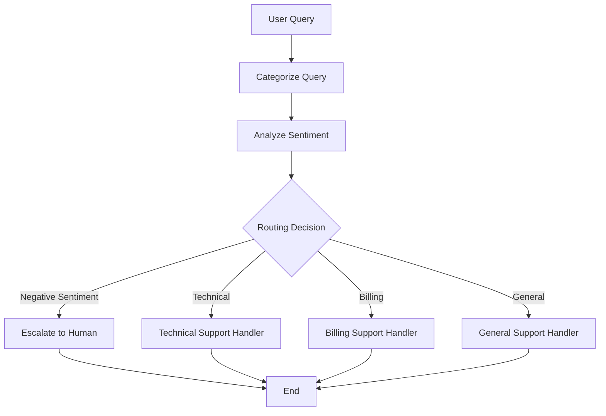

# Customer Support Agent · LangGraph

[](https://www.python.org/)
[](https://github.com/langchain-ai/langgraph)
[](LICENSE)

An intelligent, stateful **Customer Support Agent** built with **LangGraph** and **LangChain**. 
It categorizes incoming queries, analyses their sentiment, and either routes them
to the right specialist handler or escalates negative-sentiment queries to a human agent.


## ✨ Features

- Multi-stage intelligent workflow (Categorization → Sentiment Analysis → Routing)
- Automatic escalation for negative sentiment queries
- Specialized handlers for Technical, Billing, and General support
- Fully modular and extensible design
- Graph visualization support
- Clean project structure with tests


## Workflow

## 📋 Workflow



## Quick start

```bash
# 1. Clone / copy the project
cd customer_support_agent

# 2. Create and activate a virtual environment
python -m venv .venv && source .venv/bin/activate

# 3. Install dependencies
pip install -r requirements.txt

# 4. Configure environment
cp .env.example .env
# Open .env and add your OPENAI_API_KEY

# 5. Run
python main.py
```

## Project layout

```
customer_support_agent/
├── main.py                  # Entry point — run sample queries
├── requirements.txt
├── .env.example
│
├── config/
│   ├── __init__.py
│   └── settings.py          # Loads .env, exposes constants
│
├── agents/
│   ├── __init__.py
│   ├── state.py             # State TypedDict
│   ├── nodes.py             # Node functions + routing logic
│   └── support_agent.py     # Graph assembly + run_customer_support()
│
├── utils/
│   ├── __init__.py
│   └── visualize.py         # Save / display the graph as PNG
│
└── tests/
    ├── __init__.py
    └── test_nodes.py        # Unit tests (pytest)
```

## Running tests

```bash
pytest tests/
```

## Visualising the graph (Jupyter)

```python
from utils import show_graph
show_graph()
```

Or save it to a PNG:

```python
from utils import save_graph
save_graph("workflow.png")
```

## Extending the agent

| Goal | Where to change |
|---|---|
| Add a new query category (e.g. *Returns*) | `nodes.py` → new `handle_returns` function + update `route_query` |
| Swap the LLM | `config/settings.py` → change `MODEL_NAME` |
| Add memory / conversation history | `state.py` → add a `history` field, update nodes |
| Connect to a real ticket system | `nodes.py` → call your API inside the handler nodes |


## 🔧 Tech Stack

- **LangGraph**: Stateful multi-actor workflows
- **LangChain**: LLM orchestration and prompting
- **OpenAI**: GPT models (easily swappable)
- **Pydantic**: Data validation and state management
- **python-dotenv**: Environment variable management


## 🤝 Contributing

Contributions are welcome! Feel free to open issues or submit pull requests.

1. Fork the project
2. Create your feature branch (`git checkout -b feature/amazing-feature`)
3. Commit your changes (`git commit -m 'Add some amazing feature'`)
4. Push to the branch (`git push origin feature/amazing-feature`)
5. Open a Pull Request


## 📄 License

This project is licensed under the **MIT License** - see the [LICENSE](LICENSE) file for details.


**Built with ❤️ using LangGraph**
